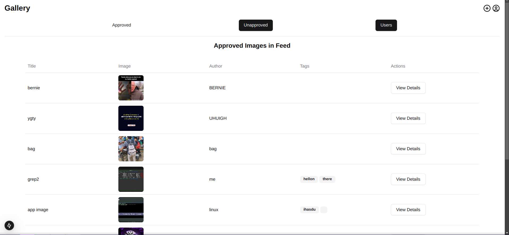
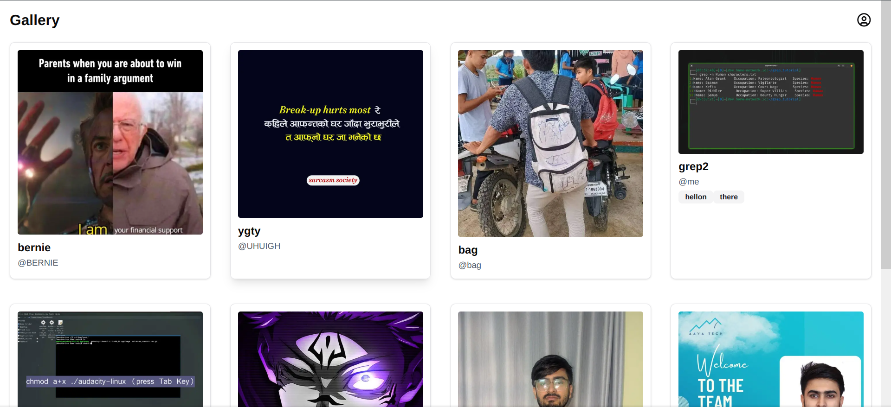
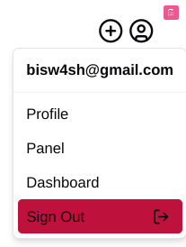
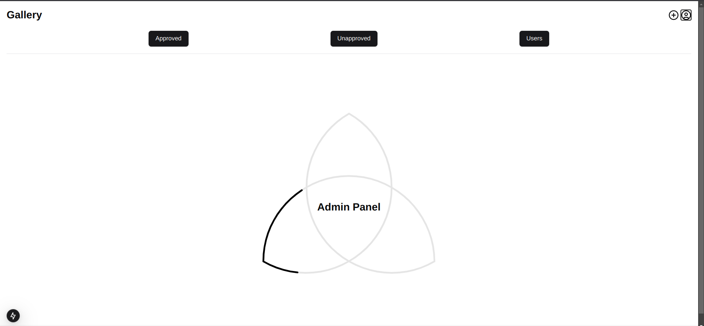
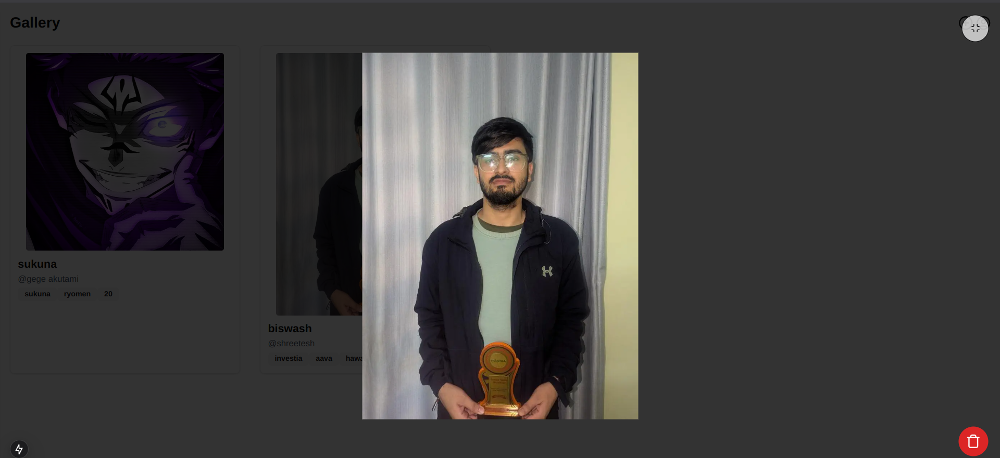
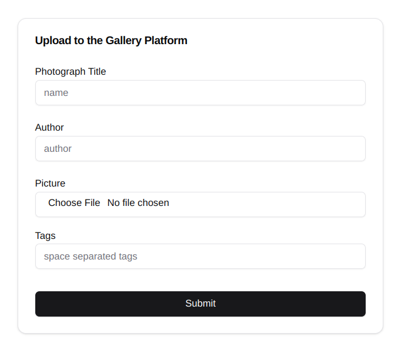

#  Gallery - Supabase + Next.js
## Getting Started
### Prerequisites

Make sure you have the following installed:

- [Node.js](https://nodejs.org/) (LTS recommended)
- [pnpm](https://pnpm.io/installation)
- [Supabase CLI](https://supabase.com/docs/guides/cli)

### Installation

Clone the repository and install dependencies:

```sh
# Clone the repository
git clone <repo_url>
cd <project_directory>

# Install dependencies
pnpm install
```

### Setting up Supabase

1. Create a Supabase project at [Supabase](https://supabase.com/)
2. Copy your project API keys and database URL from the Supabase dashboard.
3. Create a `.env.template` file and add the following:

```sh
NEXT_PUBLIC_SUPABASE_URL=
NEXT_PUBLIC_SUPABASE_ANON_KEY=
SUPABASE_SERVICE_ROLE_KEY=
```

### Running the Project

To start the development server:

```sh
pnpm dev
```

### Project Structure

```
/public/
│── ApprovedCard.png
│── approved.png
│── feed.png
│── menu.png
│── panel.png
│── profile.png
│── upload.png
│── README.md
```

### Preview

For those who cannot run the project locally, here are preview images:








